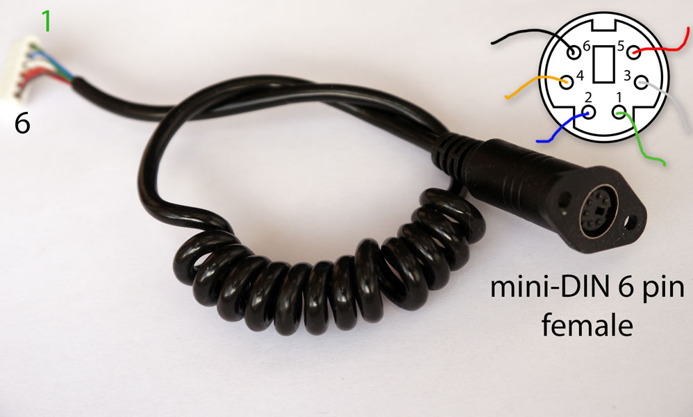

# About

This is a program for the [ESP32](https://circuits4you.com/2018/12/31/esp32-devkit-esp32-wroom-gpio-pinout/) to behave like a Thurstmaster T300 wheel rim.

**Why:** This software will allow for customised maps and macros to automate settings such as setting ERS Mode/Fuel Mix etc.

# Documentation

Thrustmaster Wheelbase cable pinout (PS/2 connector, also known as mini-Din 6pin female):

**Imortant:** Thrustmaster base sends 3v3 to the ESP. Do not send power to it. 3v3 logic levels are used.

| PIN # | Wire Colour | Function | Notes                                                       |
| ----- | ----------- | -------- | ----------------------------------------------------------- |
| 1     | Green       | not used |
| 2     | Blue        | Ground   |
| 3     | White       | MISO     | Mmaster in, slave out. Used to send data to the base        |
| 4     | Yellow      | SS       | Slave select/Chip select When low, we can send data to MISO |
| 5     | Red         | CLK      | Clock impulses                                              |
| 6     | Black       | Power    | +3.3                                                        |

  
ESP -> T300

| ESP Pin | Wire Colour | Function          | Female PS/2 Pin # |
| ------- | ----------- | ----------------- | ----------------- |
| GND     | Blue        | Ground            | 2                 |
| 32      | White       | MISO              | 3                 |
| 34      | Yellow      | Chip/Slave Select | 4                 |
| 35      | Red         | Clock             | 5                 |
| 3v3     | Black       | Ground            | 6                 |

# Button Mappings

Button mappings (we send 8 bytes to wheelbase, only 3 first bytes matter, only 15 bits are used for buttons)

Byte 1  
1 - not used  
1 - not used  
0 - not used  
1 - not used  
0 - not used  
0 - not used  
0 - not used  
1 – not used

Byte 2  
1 – not used  
1 – X  
1 – O  
1 – \[\] (Square)  
1 – Options  
1 – R1/Gear Up  
1 – /\ (Triangle)  
1 – R2 (button 9)

Byte 3  
1 – Share  
1 – PS  
1 – D-Pad Down  
1 – L1/Gear Down  
1 – D-Pad Right  
1 - D-Pad Left  
1 - D-Pad Up  
1 - L2

# Thanks to

Taras I ([Blog](https://rr-m.org/blog/))
